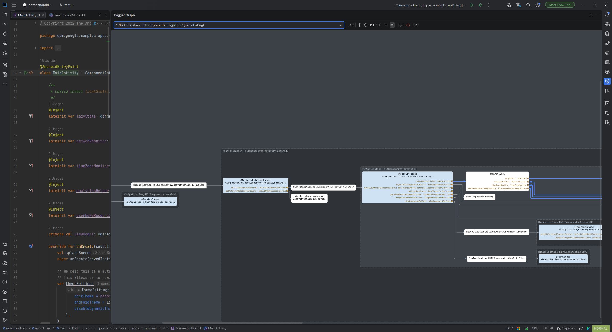

# Squire — Dagger/Hilt Dependency Graphs in Your IDE

> [中文文档](zh/index.md)

Squire visualizes the full Dagger/Hilt binding graph of any root `@Component` in your project, as an interactive, navigable diagram inside IntelliJ IDEA and Android Studio.

## Why Squire

Dagger wiring is invisible at compile time: bindings come from module methods, `@Inject` constructors, component dependencies, multibinding contributions, and — with Hilt — generated component hierarchies per build variant. When injection fails or the wrong implementation shows up, you normally read generated code by hand. Squire resolves the same graph the compiler sees and draws it, so you can answer "where does this binding come from?" and "who depends on this type?" in seconds.

## Documentation

> **Just installed Squire?** The IDE runs a one-time project re-index to build Squire's Dagger binding index, and **the tool window stays empty until indexing finishes**. This is expected — see [Getting started](getting-started.md).

- [Getting started](getting-started.md) — requirements, first graph, Hilt prerequisites
- [The tool window](toolwindow.md) — toolbar, toggles, floating window, progress, empty states
- [Reading the graph](reading-the-graph.md) — node types, edges, ports, colors, multibindings
- [Navigation](navigation.md) — graph → source, gutter icons → graph
- [Hilt, variants and multi-module projects](hilt-and-variants.md)
- [Troubleshooting](troubleshooting.md) — refresh vs. force refresh, stale graphs, index issues
- [Known limitations](limitations.md)
- [End User License Agreement](eula.md)

## Issue tracker

Report bugs and request features on the [issue tracker](https://github.com/xncHung/squire_docs/issues). When reporting a graph problem, please include: IDE and version, Squire version, whether the project uses Hilt (KSP or KAPT), the selected build variant, and a screenshot of the graph (or the missing piece of it).
